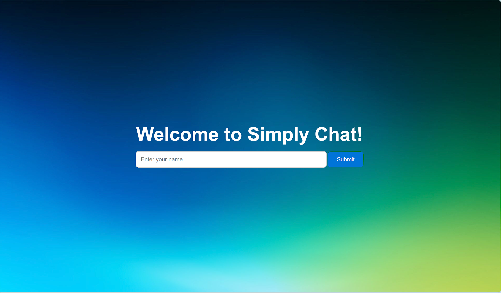

# Simply Chat

Simply Chatbot is an interactive, voice-enabled chatbot that provides a seamless conversation experience using both text and speech inputs. The chatbot allows users to communicate with it by typing messages or using voice commands. It also offers audio responses, enhancing the user experience with an engaging, dynamic interface.

## Technologies Used

### Backend:
- **Flask framework** with **Jinja2 template engine** for rendering HTML templates.

### Frontend:
- **HTML**, **CSS**, and **JavaScript** for the user interface.

### APIs Used:
- **Gemini**: For the AI model that powers the chatbot's responses.
- **ElevenLabs**: To generate more human-like tones in the chatbot's voice.

## Installation :
<ol>
    <li>Clone the repository:
        <pre><code>git clone https://github.com/SohamBEGINS/voice_chatbot</code></pre>
    </li>
    <li>Navigate to the project directory:
        <pre><code>cd voice-chatbot</code></pre>
    </li>
    <li>Install dependencies:
        <pre><code>pip install -r requirements.txt</code></pre>
    </li>
    <li>Run the Flask application:
        <pre><code>python app.py</code></pre>
    </li>
    <li>Open your browser and go to <code>http://127.0.0.1:5000</code>.</li>
</ol>

### Prerequisites

- Python 3.x
- pip (Python package installer)

## Usage

- **Name Input**: Upon opening the chatbot, the user is prompted to input their name.
- **Dynamic Greeting**: Once the name is submitted, the chatbot greets the user with a personalized message.
- **Messaging**: Users can type a message or use the microphone button to speak to the chatbot.
- **Bot Response**: The chatbot replies with either text or audio. Audio will automatically play, and users can stop it with a "Stop" button.

## How it Works

The chatbot utilizes a simple backend API, which processes the user's input and generates responses. The bot replies with either a text message or an audio file, depending on the nature of the request.

- **Text Responses**: The chatbot provides static or dynamic text responses .
- **Speech Recognition**: The chatbot supports speech-to-text capabilities using the Web Speech API for voice inputs.

## Contact

If you have any questions, feel free to reach out to me at gangulysoham67@gmail.com.
